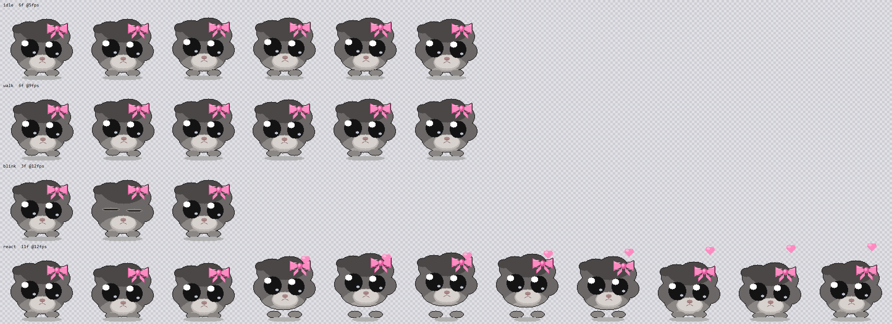

# Hamster — desktop pet Windows branché sur Claude Code

Une mascotte en pixel art qui vit en overlay en bas de l'écran et reflète en temps réel
ce que fait Claude Code. Quand Claude bosse, elle bosse. Quand plus rien ne tourne, elle glande.
Quand Claude lance des sous-agents, le hamster se duplique : un mini hamster par sous-agent.

Le personnage : hamster gris, énormes yeux noirs brillants, un nœud rose sur le côté du crâne.
Ces deux signatures visuelles sont tenues dans 100 % des frames — c'est la contrainte de
lisibilité à 128 px.



Projet indépendant, sans lien avec Anthropic. Claude et Claude Code sont des produits
d'Anthropic ; le hamster lit seulement les fichiers que Claude Code écrit déjà sur ta machine.
Rien ne sort de la machine : aucun réseau, aucun compte, aucune télémétrie.

## Télécharger et lancer, sans rien installer

1. Télécharge **`Hamster-win-x64.zip`** (environ 43 Mo, 108 Mo une fois décompressé : le
   runtime .NET est inclus) depuis la
   [dernière version](https://github.com/legb78/hamster/releases/latest).
2. **Décompresse d'abord** : clic droit sur le zip, **Extraire tout**, dans un dossier qui ne
   bougera plus (par exemple `Documents\Hamster`). Ne lance pas l'exe depuis l'aperçu du zip :
   il tournerait depuis un dossier temporaire, et « Lancer au demarrage » retiendrait ce chemin.
3. Double-clique sur **`Hamster.exe`**. Rien d'autre à installer. Windows prévient que
   l'exécutable n'est pas signé : **Informations complémentaires**, puis **Exécuter quand
   même** (pas de signature de code : elle est payante). Si **Smart App Control** est actif
   (Windows 11), il peut bloquer un exécutable non signé sans proposer ce bouton. Si ton
   antivirus s'inquiète, compare l'empreinte SHA-256 du fichier à celle publiée dans les notes
   de la version (`Get-FileHash .\Hamster.exe` dans PowerShell).
4. Le hamster apparaît en bas de l'écran. Menu : clic droit sur lui, ou clic sur son icône
   dans la zone de notification (sous la flèche `^` si Windows l'y range).
   **Ramene-le ici** le fait revenir sous ta souris si tu ne le vois plus.
   **Lancer au demarrage** le fait démarrer avec ta session.
5. Facultatif : pour qu'il décroche aussi quand Claude attend ton **autorisation**, ajoute le
   hook, voir [Brancher le hook](#brancher-le-hook-facultatif).

**Mettre à jour** : menu → **Quitter**, remplace `Hamster.exe` par le nouveau au même endroit
(la case « Lancer au demarrage » reste valable tant que le chemin ne change pas), relance-le.
Une seconde copie qui démarre alors que la première tourne se ferme sans rien dire : quitte
toujours l'ancienne d'abord.

**Retirer** : menu → décoche **Lancer au demarrage**, puis **Quitter**. Supprime ensuite le
dossier de l'exe, `%APPDATA%\Hamster` (réglages et `cycle.log`) et `%USERPROFILE%\.hamster`.
Si tu avais branché le hook, retire son bloc de `%USERPROFILE%\.claude\settings.json` : sans
cela, la variante Git Bash afficherait une erreur de hook à chaque notification, et la
variante PowerShell continuerait d'écrire en silence dans `%USERPROFILE%\.hamster\events.jsonl`.

### Brancher le hook (facultatif)

Sans hook, le hamster suit tout, sauf les demandes d'autorisation. Pour les ajouter :

1. Choisis la variante. Si Git Bash est installé (`C:\Program Files\Git` existe, ou
   `where sh` répond dans une invite de commandes), prends `hook-git-bash.json` ; sinon
   `hook-powershell.json`. Dans le dépôt, ce sont `Hooks/settings-snippet.json` et
   `Hooks/settings-snippet.powershell.json`. Pour la variante Git Bash, lance le hamster une
   fois avant : c'est lui qui dépose `%USERPROFILE%\.hamster\hook.sh`.
2. Ouvre `%USERPROFILE%\.claude\settings.json` (c'est `~/.claude/settings.json`), les réglages
   de Claude Code.
   - Le fichier n'existe pas : copie le fichier de la variante à sa place, tel quel.
   - Il existe sans clé `"hooks"` : ajoute la clé `"hooks"` du fichier de la variante à côté des
     autres clés (attention aux virgules).
   - Il a déjà une clé `"hooks"` : ajoute seulement l'entrée `"Notification"` dedans (ou, si
     `"Notification"` existe déjà, ajoute l'objet qu'elle contient à sa liste). Ne crée jamais
     un second `"hooks"`.
3. Garde une copie du fichier avant de le modifier. Le détail des deux variantes est plus bas,
   dans [D'où vient l'état](#doù-vient-létat).

Testé sous Windows 11, 64 bits. Windows 10 devrait fonctionner, mais n'a pas été testé.
Ni macOS ni Linux : l'app repose sur les fenêtres Windows.

### Quick start (English)

Download `Hamster-win-x64.zip` from the
[latest release](https://github.com/legb78/hamster/releases/latest), unzip it, run
`Hamster.exe` from the extracted folder, not from the zip preview (about 43 MB; nothing to
install; Windows warns that it is unsigned: **More info**, then **Run anyway**; Smart App
Control may block it outright). Right-click the hamster, or click its tray icon, for the menu;
**Ramene-le ici** brings it back under the cursor, **Lancer au demarrage** starts it with
Windows. To update: **Quitter**, replace the exe in place, run it again. Optional: merge the `hooks` block of
`hook-git-bash.json` (Git Bash) or `hook-powershell.json` into `~/.claude/settings.json` so the
hamster also picks up the phone on permission prompts. Tested on Windows 11 x64.

## Build et lancement, sans IDE

Le SDK .NET suffit (testé avec 9.0.306). Ni Visual Studio, ni MSVC Build Tools, ni paquet NuGet.

```powershell
.\Scripts\build.ps1     # compile l'app et régénère les sprites + la palette
.\Scripts\run.ps1       # lance, logs sur stderr dans la console
.\Scripts\publish.ps1   # archive à publier : exe autonome + LICENSE, NOTICE, LISEZMOI, hooks
```

Tests, sans fenêtre (applications console, code de sortie 1 au moindre échec) :

```powershell
dotnet run --project tests\Hamster.Activity.Tests -c Release   # parseur, watchers, modèle, relecture des vrais transcripts
dotnet run --project tests\Hamster.App.Tests -c Release        # directeur, minis, rendu, étiquettes, sonnerie, hub, réglages, clé Run (valeurs HamsterTest)
```

Le hamster est visible dès le lancement. Une seule instance par session : `run.ps1` arrête
l'instance installée.

Menu : clic droit sur le hamster, ou clic (gauche ou droit) sur son icône de notification.
Pour quitter : menu → Quitter.

## Ce qu'il fait

| Claude Code | Le hamster |
|---|---|
| travaille | une scène de travail choisie d'après l'outil en cours — `Bash`/`PowerShell` : terminal ; `Read`/`Grep`/`Glob`/`WebFetch`/`WebSearch` : gros livre et loupe ; `Edit`/`Write`/`NotebookEdit` : laptop ; `Agent`/`Workflow` : chef d'orchestre. Puis une autre toutes les 8 à 18 s, tirée au hasard selon des poids (laptop 25, livre 20, terminal 20, labo 15, chef d'orchestre 15, réflexion 5). Il ne se balade pas. |
| attend ta réponse (question, plan à valider, autorisation) | il répond au téléphone, avec **le nom du projet** au-dessus de la tête : c'est la conversation qui a besoin de toi. Une autre conversation qui attend en même temps a son mini au téléphone, avec lui aussi le nom de son projet en permanence |
| a fini une tâche | saut et feux d'artifice (3 s) |
| erreur d'outil ou d'API | tête catastrophée (2 s), puis il se remet au travail |
| rien | balade, puis après le délai de chill (10 s par défaut) : console, grignotage, sieste, étirements, skate, entrecoupés de poses et de petites balades |

**Les minis.** Chaque sous-agent actif, et chaque autre session Claude Code active, a son mini
hamster, à 50 %, dont le nœud prend une couleur stable (dérivée de l'id du sous-agent ou du
dossier de la session). Il apparaît dans un nuage de fumée, disparaît dans des étincelles et
tourne autour des pieds du principal (un tour en 40 s), derrière lui sur l'arc arrière, devant
sur l'arc avant. Un sous-agent garde la même scène de travail du début à la fin. Au-delà de
six minis, un badge `+N` compte les autres. Les conversations qui attendent ta réponse passent
en tête, la plus récente attente d'abord, puis les plus récents : des sous-agents ne font jamais
disparaître une attente du tableau, même pendant la fête de 3 s qui passe devant une attente
(demande d'un sous-agent quand le fil principal finit son tour). Cela vaut jusqu'à six attentes
parmi les minis, sept avec celle du principal : au-delà, les plus anciennes n'ont plus de mini,
comptées dans le `+N`.

Pour que l'arc avant ne passe jamais devant le visage, le principal monte de 42 px (sprite)
tant qu'il y a des minis : les minis de devant restent sous son museau. Vérifié au pixel sur
toutes les frames par `Hamster.App.Tests`, avec un filet de sécurité pour ce qui dépasse du
corps d'un mini (bulle du téléphone, feux d'artifice) : rien ne se peint sur le visage.

**Interactif.** Au survol, une étiquette apparaît au-dessus du hamster survolé : projet et
état pour une session, description pour un sous-agent. Clic sur un mini : il réagit. Clic et
glisser sur le principal : comme avant (réaction, déplacement).

**Étiquettes.** Celle d'une conversation en attente reste affichée tant qu'elle attend, au-dessus
du principal ou de son mini, avec un cadre jaune ; survolée, celle d'un mini garde son texte
(plus longue, elle pourrait changer de place et fuir le curseur). Près du bord de l'écran, une
étiquette glisse vers l'intérieur plutôt que d'être coupée : ses bords restent dans la zone de
travail de l'écran du hamster. Une étiquette de mini tourne avec lui, mais ne se pose jamais sur le visage du
principal ni sur une autre étiquette (elle monte alors au-dessus), et évite sa zone de tête tant
que la place le permet. Cette zone est **stable** : la même pour tous les clips et les deux sens,
calculée une fois. C'est l'union, sur les frames des clips de base du personnage (repos, marche,
clignement, réaction, téléphone), des pixels opaques du haut jusqu'au bas du visage, sans les
accessoires qui ne sont pas de lui (cœur de la réaction, socle et cordon du téléphone) mais avec
la bulle et le combiné du téléphone ; elle contient aussi le visage de chaque clip. Tirée du clip
courant, avec ses accessoires (feux d'artifice, bol, tableau), elle faisait sauter l'étiquette
d'un mini jusqu'à 338 px quand le principal changeait de clip ; au milieu de l'écran, sa place ne
dépend plus du clip. **Limite mesurée** : principal poussé contre le bord de l'écran, quand la
place manque, environ 20 % des étiquettes dépendent encore du clip, avec des sauts jusqu'à
200 px environ. Si elle gêne, l'étiquette passe à côté de la zone de tête, du côté du mini ; si la place
manque de ce côté (principal poussé contre le bord de l'écran, nom long), elle se pose dessous,
sur le mini lui-même, mais jamais sur le corps du principal (du bas du visage à la ligne de
base). Rien ne tient hors de la zone de tête : mêmes règles autour du seul visage. Rien ne tient
non plus : elle reste au-dessus du mini, quitte à toucher la zone de tête, montée au-dessus du
visage s'il le faut. Elle ne passe jamais de l'autre côté du principal, où elle semblerait
appartenir à un autre mini, sauf si elle est plus large que la place entre le bord de l'écran et
le principal. Sa place se choisit sans le rebond du mini (±1 px sprite), qui ne fait que la
décaler verticalement avec lui : elle ne saute pas d'un côté à l'autre au rythme du sautillement,
et n'empiète sur le visage à aucun moment du rebond. Vérifié tout le tour de l'orbite (au quart
de degré pour le rebond), sur tous les clips du principal, miroir compris, aux trois échelles,
au bord de l'écran et au milieu, par `Hamster.App.Tests`. L'étiquette du principal, elle, reste
posée au-dessus du clip courant.

**Sons**, désactivés par défaut (menu → **Son**) : téléphone (`Windows Ringin.wav`) quand une
conversation de plus se met à attendre ta réponse, la principale ou celle d'un mini. Une
attente se reconnaît à son heure de début : déjà annoncée, elle ne resonne pas tant que ce début
ne change pas, ni quand son mini prend la place principale, ni quand la fête de fin de tour
(3 s) la masque un instant (demande d'un sous-agent pendant que le principal finit son tour),
ni quand elle revient après avoir été cachée (plus de six attentes à la fois). `tada.wav` en
fin de tâche, `Windows Navigation Start.wav` à l'apparition d'un sous-agent, au plus un toutes
les 10 s. Jamais en boucle, rien pendant les 3 s d'amorçage (les transcripts relus ne sont pas
des nouveautés) ni tant que le hamster est en pause ou caché. Coupés quand Windows refuse les
notifications (`SHQueryUserNotificationState` ≠ `QUNS_ACCEPTS_NOTIFICATIONS` : application
plein écran, mode présentation, session verrouillée…). Chaque nouvelle attente est journalisée
(`nouvelle attente: ...`), son coché ou non.

**Overlay de debug** (menu) : clip, état, outil, nombre de minis, état des deux sources.
Chaque changement d'état est journalisé sur stderr.

**Journal de cycle de vie** : `cycle.log`, à côté de `settings.json`. Il reçoit quelques lignes
par jour (démarrage, arrêt et sa raison, veille, reprise, fin de session Windows, exception non
gérée) et il est coupé de moitié au-delà de 64 Ko. Un arrêt sans ligne « sortie du processus »
signe un kill.

## Réglages

Dans `%APPDATA%\Hamster\settings.json` ; les clés absentes gardent leur valeur par défaut.

| Clé | Défaut | Menu |
|---|---|---|
| `Scale` | 2 | Taille |
| `OpacityPercent` | 100 | Opacite |
| `ChillDelaySeconds` | 10 | Delai avant le mode chill (5, 10, 30, 60 s) |
| `SoundEnabled` | false | Son |
| `OnlyWithClaudeDesktop` | false | Seulement avec Claude Desktop |
| `Paused`, `DebugOverlay`, `AnchorX`, `AnchorY` | | Pause, Overlay de debug, position |
| `ClaudeDesktopPathMarkers` | `["\\WindowsApps\\Claude_"]` | à la main, voir plus bas |

`OnlyWithClaudeDesktop` passe à `false` par défaut : le hamster suit Claude Code, qui tourne
aussi dans un terminal ou VS Code. Un `settings.json` existant qui porte `true` le garde.

Variables d'environnement, pour les tests surtout :

| Variable | Remplace |
|---|---|
| `HAMSTER_SETTINGS_DIR` | le dossier `%APPDATA%\Hamster` des réglages |
| `HAMSTER_PROJECTS_ROOT` | `%USERPROFILE%\.claude\projects`, les transcripts lus |
| `HAMSTER_EVENTS_PATH` | `%USERPROFILE%\.hamster\events.jsonl`, écrit par le hook |
| `HAMSTER_RUN_VALUE` | le nom `Hamster` de la valeur de démarrage (les tests utilisent `HamsterTest`) |

## Lancement au démarrage et installation

```powershell
.\Scripts\install.ps1     # publie dans %LOCALAPPDATA%\Programs\Hamster et le lance
.\Scripts\uninstall.ps1   # voir ci-dessous : garde les réglages, ne touche pas à Claude Code
```

`uninstall.ps1` retire la valeur de démarrage (et sa marque `StartupApproved`), arrête le
hamster, supprime le dossier installé, puis `~/.hamster` : `hook.sh`, `events.jsonl` et
`events.jsonl.1` (le dossier reste s'il contient d'autres fichiers, qu'il nomme). Il garde
`%APPDATA%\Hamster\settings.json`. Il **ne défait pas tout** : il ne lit ni ne modifie jamais les
réglages de Claude Code. Si tu as ajouté le bloc `Notification` du hook (voir plus bas) à
`~/.claude/settings.json`, retire-le **à la main** ; le script le rappelle en finissant. Tant
qu'il reste, la variante PowerShell continue d'écrire en silence dans
`%USERPROFILE%\.hamster\events.jsonl` (sans rotation, faute d'app pour la faire), et la variante
Git Bash lance à chaque notification un hook dont le script n'existe plus, et Claude Code
affiche une erreur de hook non bloquante (d'après la
[doc des hooks](https://code.claude.com/docs/en/hooks) : code de sortie 127, « the action
proceeds »).

Menu → **Lancer au demarrage** : la case écrit ou retire la valeur
`HKCU\Software\Microsoft\Windows\CurrentVersion\Run\Hamster` (le chemin de l'exe en cours, entre
guillemets), aucun droit administrateur. Seul ce clic la modifie, jamais le lancement.

La case suit aussi le Gestionnaire des tâches. Il garde, sous
`HKCU\...\Explorer\StartupApproved\Run`, une valeur binaire du même nom, **non documentée** :
sur le poste de développement (lecture seule des 21 valeurs présentes), 12 octets dont le
premier vaut `0x02` pour une entrée active (7 valeurs, le reste à zéro) et `0x03` pour une
entrée désactivée (14 valeurs ; pour 13 d'entre elles, les 8 derniers octets se lisent comme une
date FILETIME de 2025–2026, sans doute celle de la désactivation). Aucun autre premier octet n'y
a été vu. Une entrée marquée `0x03` est désactivée : la case est donc **décochée**, et la cocher
réactive le démarrage (écrit la valeur Run et retire la marque) au lieu de le retirer. Tout
autre premier octet, ou une marque absente, compte comme actif : on ne devine pas le sens d'une
valeur jamais vue.

`install.ps1` ne crée plus la valeur Run : si elle existe déjà, il la fait pointer sur l'exe
installé.

## Avec Claude Desktop

Windows n'offre pas de déclencheur « quand l'application X démarre » sans activer l'audit
des processus, un réglage de sécurité système. Avec **Seulement avec Claude Desktop**, le
hamster fait donc l'inverse : il reste **caché** tant que Claude Desktop ne tourne pas,
**apparaît** quand il démarre et se cache quand il se ferme. Délai : jusqu'à 2 s, le temps
d'une énumération de processus. Pendant l'attente, l'icône de la zone de notification reste
là pour quitter ou changer de mode.

Le nom de processus ne suffit pas à reconnaître Claude Desktop : Claude Code (CLI, extension
VS Code) s'appelle lui aussi `claude.exe`. Le hamster lit donc le chemin de l'exécutable et
cherche `\WindowsApps\Claude_`, le dossier du paquet MSIX.

Si Claude Desktop est installé ailleurs, ajouter un fragment de son chemin dans
`%APPDATA%\Hamster\settings.json` (créer le fichier s'il n'existe pas). En JSON, **les
antislashs se doublent** :

```json
{ "ClaudeDesktopPathMarkers": ["\\WindowsApps\\Claude_", "\\chemin\\vers\\Claude\\"] }
```

Le hamster relit ce réglage dans les 2 s, sans redémarrage, et ne l'écrase plus en sauvegardant.
Commentaires et virgule finale sont tolérés ; un fichier vraiment illisible est copié en
`settings.json.bad` et signalé par une notification Windows.

Les scripts arrêtent le hamster proprement (il retire son icône de notification) avant de
recourir au kill, et seulement dans la session Windows courante.

## D'où vient l'état

- **Source principale : les transcripts** que Claude Code écrit déjà dans
  `~/.claude/projects/<slug>/<session>.jsonl`, et ceux des sous-agents dans
  `<session>/subagents/agent-<id>.jsonl` (plus `subagents/workflows/<wf>/`), avec un
  `agent-<id>.meta.json` qui donne leur description. Lus en lecture seule, sans jamais bloquer
  Claude Code (`FileShare.ReadWrite | FileShare.Delete`), par suivi de fin de fichier. Coût sur
  les sessions : zéro. Latence mesurée de l'écriture d'une ligne au changement d'état dans le
  journal : 60 à 64 ms en général, 170 ms au pire.
- **Source complémentaire : un hook `Notification`.** Les demandes d'autorisation n'apparaissent
  pas dans les transcripts ; seul ce hook les signale. Le hamster dépose le script
  `~/.hamster/hook.sh` au lancement, mais **ne branche rien** : il ne touche jamais aux réglages
  de Claude Code. Pour l'activer, fusionner à la main ce bloc (`Hooks/settings-snippet.json`)
  dans les réglages de Claude Code, par exemple `~/.claude/settings.json`
  ([doc des hooks](https://code.claude.com/docs/en/hooks)) :

  ```json
  {
    "hooks": {
      "Notification": [
        {
          "matcher": "permission_prompt|worker_permission_prompt|agent_needs_input|elicitation_dialog|elicitation_url_dialog",
          "hooks": [
            { "type": "command", "command": "sh \"$HOME/.hamster/hook.sh\"", "async": true, "timeout": 5 }
          ]
        }
      ]
    }
  }
  ```

  Le hook recopie la notification dans `~/.hamster/events.jsonl` et rend la main aussitôt
  (`async`, code 0 quoi qu'il arrive). Il passe par `sh` : sous Windows, il faut Git Bash. Un
  lancement de `sh` coûte de 160 à 310 ms (mesuré), en arrière-plan.

  **Sans Git Bash**, Claude Code lance les hooks avec PowerShell (doc des hooks : `"bash"` par
  défaut, `"powershell"` sous Windows quand Git Bash n'est pas installé), et `sh` n'y existe
  pas. Utiliser alors cette variante (`Hooks/settings-snippet.powershell.json`), qui n'a besoin
  d'aucun fichier :

  ```json
  {
    "hooks": {
      "Notification": [
        {
          "matcher": "permission_prompt|worker_permission_prompt|agent_needs_input|elicitation_dialog|elicitation_url_dialog",
          "hooks": [
            {
              "type": "command",
              "shell": "powershell",
              "command": "$ErrorActionPreference = 'Stop'; try { [Console]::InputEncoding = [Text.UTF8Encoding]::new($false); $d = [IO.Path]::Combine($env:USERPROFILE, '.hamster'); [void][IO.Directory]::CreateDirectory($d); [IO.File]::AppendAllText([IO.Path]::Combine($d, 'events.jsonl'), [Console]::In.ReadToEnd().TrimStart([char]0xFEFF) + [char]10) } catch { }; exit 0",
              "async": true,
              "timeout": 10
            }
          ]
        }
      ]
    }
  }
  ```

  Même travail : recopier la notification, UTF-8 sans BOM, silence et code 0 quoi qu'il arrive.
  Testé par `Hamster.Activity.Tests` avec `powershell.exe -NoProfile -NonInteractive -Command`
  et l'entrée standard (payload indenté et accentué, relu par le watcher), environ 550 ms en
  arrière-plan. La doc ne détaille pas la ligne de commande exacte qu'emploie Claude Code : la
  commande est vérifiée, pas l'appel par Claude Code lui-même. Sans le hook, tout marche
  sauf les demandes d'autorisation : le téléphone ne sonne alors que pour les questions et les
  plans à valider, qui, eux, sont dans les transcripts.

  `worker_permission_prompt` est traité comme `permission_prompt`. Ce type ne figure pas dans
  la doc des hooks : il vient du binaire de Claude Code 2.1.283. Il doit figurer dans le
  `matcher` : un matcher fait seulement de lettres, chiffres, `_`, `-` et `|` est une liste de
  noms **exacts** (doc des hooks), et `permission_prompt` n'y attrape donc pas
  `worker_permission_prompt`. Un bloc déjà fusionné avec l'ancien matcher est à compléter à la
  main.

Le format des transcripts est interne et non documenté : le parsing est tolérant (une ligne non
reconnue ne produit rien) et le test de relecture de `Hamster.Activity.Tests` sert de détecteur
si une mise à jour de Claude Code le change.

### Attentes, conversation principale et sous-agents

- **Durée d'une attente.** Une attente signalée par le hook (autorisation : `permission_prompt`
  ou `worker_permission_prompt` ; `agent_needs_input`, `elicitation_dialog`,
  `elicitation_url_dialog`) expire après 10 min ; une question `AskUserQuestion` ou un plan
  `ExitPlanMode`, lus dans le transcript, restent 1 h. D'après le binaire de Claude Code 2.1.283
  (déduction, non observée), ces deux dialogues émettent aussi une notification
  `permission_prompt` quelques secondes après : pour le même fil, elle ne change rien, l'attente
  garde son heure de début et son délai d'1 h.
- **Place principale.** Une attente ne prend la place de la conversation principale que si elle a
  moins de 2 min, ou si elle est postérieure à la dernière activité de la principale. Une attente
  périmée rend la place à une attente fraîche, sinon à une conversation active qui s'est
  manifestée depuis son début ; elle reste visible en mini, au téléphone, avec son étiquette, et
  ne reprend pas la place tant qu'elle ne dit rien de neuf, même quand la conversation qui l'a
  remplacée s'arrête (le principal se repose alors, le mini reste au téléphone), et même quand
  son attente expire alors que ses sous-agents la gardent active. De même, une principale qui
  perd la place au profit d'une attente fraîche ne la reprend, quand cette attente s'éteint,
  qu'après un nouvel événement d'elle-même ou de la conversation qui l'a remplacée. Tout nouvel
  événement de sa part (nouvelle demande, réponse, activité d'un sous-agent) la rend de nouveau
  candidate. Une conversation ne prend la place, par l'effet du temps, que si elle doit rester
  active encore 10 s au moins sans rien écrire. Ensemble, ces règles excluent tout aller-retour
  X, Y, X sans événement nouveau de X ou de Y entre les deux changements, si longtemps après que
  ce soit : vérifié par `Hamster.Activity.Tests` sur 1000 graines de 4 h d'un fuzz scripté
  (tours, outils longs et muets, questions et autorisations, sous-agents de fond, sessions
  tuées, lectures en retard) et 120 graines de 3 h d'un fuzz aléatoire.
- **Priorité dans les minis.** Au-delà de six minis, les conversations en attente restent : elles
  passent en tête, la plus récente d'abord, avant les sous-agents et les autres conversations,
  y compris pendant la fête de 3 s qui passe devant une attente encore en cours. C'est exact
  jusqu'à six attentes parmi les minis (sept avec celle du principal) : au-delà, les plus anciennes sont comptées dans le badge `+N`,
  sans mini ni étiquette, et la sonnerie ne les annonce pas une seconde fois quand elles reviennent.
- **Conversation inconnue.** Une notification pour une conversation dont aucun transcript n'a
  encore rien dit est ignorée, et comptée dans l'état du hook de l'overlay de debug
  (`N ignorees`).
- **Sous-agents.** Un sous-agent sans outil en cours et muet depuis 3 min disparaît (Claude Code
  fermé en plein travail, par exemple) ; avec un outil en cours, il tient 30 min. Un sous-agent au
  premier plan se termine quand son résultat arrive au fil principal (le `tool_result` de l'outil
  `Agent` qui l'a lancé), même si son propre transcript s'arrête sans fin de tour.
- **Limite connue : le téléphone après une autorisation accordée.** Claude Code n'écrit rien
  quand tu accordes l'autorisation : la première ligne qui lève l'attente est le résultat de
  l'outil, écrit quand la commande a fini. Pendant l'exécution de la commande autorisée, le
  hamster peut donc rester au téléphone, **10 min au plus** (l'expiration ci-dessus), faute de
  signal de réponse.

Garde-fous : une session qui travaille sans rien écrire pendant 3 min est considérée inactive
(un outil unique plus long fait donc passer le hamster au repos jusqu'à son résultat) ; une
session muette depuis 2 h est oubliée ; une ligne `api_error` datée d'avant la fin du tour mais
écrite après elle (la relecture des vrais transcripts en compte) ne rouvre pas le tour. Pour les
attentes, la place principale et les sous-agents, voir juste au-dessus (10 min, 1 h, 2 min, 10 s,
3 min, 30 min).

## Coût mesuré

Sur ce poste, en cycles (`QueryProcessCycleTime`), 30 s par mesure, échelle 2x :

| | CPU (% d'un cœur) | Mémoire privée |
|---|---|---|
| version précédente (celle de `main`, d'après la date de l'exe installé), au repos | 1,47 % | 17,8 Mo |
| cette version, au repos, watchers compris | 1,20 % | 27,5 Mo |
| cette version, 6 minis en orbite et badge +2 | 1,45 % | 28,2 Mo |

Les frames restent en indices de palette (2,3 Mio pour 148 frames, contre 18,5 Mio en ARGB avec
miroir) et sont converties au blit ; les minis recolorent leur nœud par la palette. Cadence du
timer : le clip le plus rapide affiché, borné à 6–12 Hz.

## Structure

```
src/Hamster.Art/       palette indexée, personnage paramétrable, clips — aucune dépendance Windows
src/SpriteGen/         rend les sheets PNG, la palette .gpl et les planches de relecture
src/Hamster.Activity/  transcripts et hook -> événements -> état des sessions et des sous-agents
src/Hamster.App/
  App/                 entrée, cycle de vie, réglages, menu, ActivityHub, sons, clé Run,
                       détection de Claude Desktop, diagnostics
  Window/              fenêtre layered, surface DIB, contrôleur, bureaux virtuels, P/Invoke
  Render/              frames indexées, animateur, composition, orbite, police 3x5, étiquettes
  State/               balade, directeur (état -> clip), foule des minis, sonnerie des attentes
tests/                 Hamster.Activity.Tests, Hamster.App.Tests
Hooks/                 hook.sh, settings-snippet.json (Git Bash), settings-snippet.powershell.json
                       (jamais appliqués automatiquement)
Assets/                palette.gpl, sprites/hamster/, preview/
Scripts/               build.ps1, run.ps1, shot.ps1, install.ps1, uninstall.ps1, common.ps1,
                       publish.ps1 (archive de release), LISEZMOI.txt (joint à l'archive)
LICENSE, NOTICE        Apache 2.0 ; composants tiers et marques
```

## Adaptation macOS → Windows : ce qui a changé et pourquoi

La spec d'origine visait macOS. Ce qui ne transposait pas, et l'arbitrage retenu :

| Spec macOS | Windows | Pourquoi |
|---|---|---|
| `NSPanel` non activable | `Form` + `WS_EX_LAYERED`, `WS_EX_TOOLWINDOW`, `WS_EX_NOACTIVATE` | Le Form ne sert que de porteur de HWND ; aucun pixel ne passe par WinForms, tout va par `UpdateLayeredWindow`. |
| `NSApp.setActivationPolicy(.accessory)` + `LSUIElement` | `WS_EX_TOOLWINDOW` + `ShowInTaskbar = false` | Ni barre des tâches, ni Alt+Tab, ni vol de focus. |
| Hit-test sur l'alpha à écrire à la main | **gratuit** | Pour une fenêtre layered en alpha par pixel, Windows fait son hit-test sur l'alpha. Vérifié par `WindowFromPoint` : les pixels opaques reçoivent la souris, les pixels à alpha 0 la laissent passer à la fenêtre du dessous. Les minis partagent la fenêtre du principal : un seul hit-test. |
| `canJoinAllSpaces` | poll 1 s + `IVirtualDesktopManager` | Aucun équivalent public. Épingler sur tous les bureaux passe par `IVirtualDesktopManagerInternal`, non documentée, dont l'IID change à chaque build de Windows. Le repli n'utilise que l'API publique. Rançon : jusqu'à 1 s de retard au changement de bureau. |
| Niveau `.statusBar` | `HWND_TOPMOST`, réaffirmé toutes les 2 s | Couvre la barre des tâches et le plein écran *borderless*. **Ne couvre pas** le plein écran exclusif DirectX — limite structurelle de Windows, sans contournement propre. |
| `NSWorkspace.willSleep` / `screenIsLocked` | `SystemEvents.PowerModeChanged`, `SessionSwitch`, `WM_POWERBROADCAST` + `GUID_SESSION_DISPLAY_STATUS` | Couvre veille, verrouillage et extinction d'écran. Le timer est arrêté, pas ralenti. |
| Échelles Retina entières | `PerMonitorV2` + échelle sprite en pixels **physiques** | Windows propose 125 / 150 / 175 %. Suivre le DPI imposerait du ×1,5 flou. L'échelle reste un entier choisi au menu ; conséquence assumée : sur un écran à 150 % le hamster paraît plus petit que le reste de l'UI. Les étiquettes, elles, suivent le DPI. |
| Bundle `.app` | `dotnet publish` → dossier + `.exe` | Pas de signature, pas de notarisation. |
| Hook à chaque outil, budget < 10 ms | transcripts + un seul hook, `Notification` | Un hook coûte ici 131 ms (sh → awk), 27 ms pour le seul `cmd /c exit` : le plancher de `CreateProcess` + Defender rend le budget inatteignable. Les transcripts donnent tout le reste gratuitement. |

## État

- [x] **Phase 1 — squelette.** Fenêtre layered always-on-top, aucune icône de barre des tâches,
      menu (clic droit + zone de notification), drag, position persistée, click-through sur
      l'alpha, balade en bas de l'écran, pause veille/verrouillage/écran éteint, instance unique,
      cadence adaptative 6–12 Hz, overlay de debug, personnage procédural.
- [x] **Lancement avec Claude Desktop** — apparition et disparition avec Claude Desktop
      (optionnel), scripts d'installation.
- [x] **Phase 2 — état.** Watcher de transcripts, hook `Notification` (script déposé, à brancher
      à la main), machine à états par session et par sous-agent, garde-fous.
- [x] **Phase 3 — scènes.** Travail (laptop, livre, terminal, labo, chef d'orchestre, réflexion),
      téléphone, fête, erreur, activités de repos.
- [x] **Phase 4 — minis, FX, sons, réglages.** Minis en orbite, fumée et étincelles, badge +N,
      étiquettes au survol, clic sur les minis, sons, lancement au démarrage depuis le menu,
      délai de chill.
- [ ] Non vérifié : rendu sur un second écran à un autre DPI, et comportement face à une
      mise à jour du format des transcripts de Claude Code.

## Licence

[Apache 2.0](LICENSE). Composants tiers et marques : voir [NOTICE](NOTICE).
